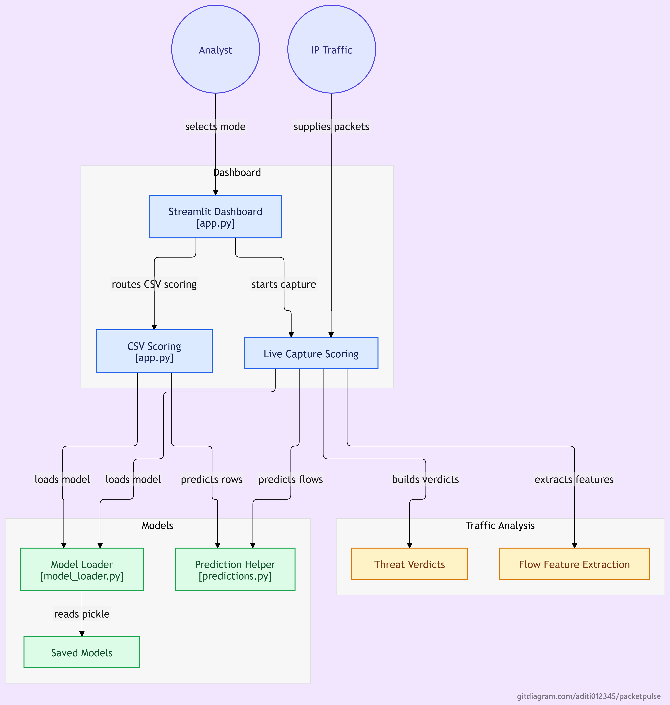

# 🔐 PacketPulse — AI-Powered Network Intrusion Detection System

PacketPulse (SentinelNet IDS) is a machine-learning-based Network Intrusion Detection System (NIDS) that classifies network traffic as **normal** or **attack** in real time. It ships with a Streamlit dashboard that can either sniff live packets off your network interface or score an uploaded CSV of traffic records with a trained model.

## 🏗️ System Architecture



## ✨ Features

- **Live Predicting (Real-Time):** Sniffs packets with Scapy for a duration you choose (1–60 s), reconstructs bidirectional flows, extracts CICIDS2017-style features, and scores each flow with the CICIDS XGBoost model.
- **CSV Predicting (Offline):** Choose the **NSL-KDD** or **CICIDS** schema, download an empty CSV template with the exact required columns, pick a model, upload your data, and get instant predictions.
- **Model comparison:** Per-dataset performance metrics are shown in the UI so you can pick the best model.
- **Visual verdicts:** Normal vs. attack counts are shown in a bar chart (green = normal, red = attack).

## 📂 Project Structure

```
packetpulse/
├── app.py                      # Streamlit dashboard (live + CSV modes)
├── list_ifaces.py              # Helper to list available network interfaces
├── feature_names.txt           # CICIDS feature names (55 features)
├── requirements.txt
├── assets/                     # Images used by the README and the UI
│   ├── System_Architecture.png
│   ├── NSL_KDD_Metrics.jpeg
│   └── CICIDS_Metrics.jpeg
├── data/
│   ├── Creating_Samples.ipynb  # Builds small sample CSVs for testing
│   ├── summary.txt             # NSL-KDD model metrics
│   └── summary2.txt            # CICIDS model metrics
├── models/                     # Trained models and scaler (.pkl)
└── utils/
    ├── cicids_flow_features.py # Packet → bidirectional flow → CICIDS features
    ├── live_flow_predictor.py  # Sniff, extract features, predict
    ├── model_loader.py         # Loads pickled models
    ├── predictions.py          # Thin wrapper around model.predict
    └── Dataset_info.ipynb      # Dataset exploration
```

## 📊 Datasets

| Dataset        | Description                                                                        | Features used                                                                                  |
| -------------- | ---------------------------------------------------------------------------------- | ---------------------------------------------------------------------------------------------- |
| **NSL-KDD**    | Classic intrusion detection benchmark (125,973 train / 22,544 test records)        | 111 (after one-hot encoding of `protocol_type`, `service`, `flag`; scaled with a saved scaler) |
| **CICIDS2017** | Flow-based dataset with realistic benign and attack traffic (DDoS, PortScan, etc.) | 55 flow features (see `feature_names.txt`)                                                     |

Both tasks are framed as **binary classification** (benign vs. attack).

## 🤖 Models & Results

### NSL-KDD

| Model         | Test Accuracy | Precision | Recall | F1     |
| ------------- | ------------- | --------- | ------ | ------ |
| XGBoost       | 0.9372        | 0.9916    | 0.8820 | 0.9336 |
| Random Forest | 0.9338        | 0.9908    | 0.8760 | 0.9298 |
| SVM           | 0.9369        | 0.9674    | 0.9044 | 0.9348 |
| Decision Tree | 0.9341        | 0.9878    | 0.8792 | 0.9304 |

### CICIDS2017

| Model         | Test Accuracy | Precision | Recall | F1     |
| ------------- | ------------- | --------- | ------ | ------ |
| XGBoost       | 0.9985        | 0.9969    | 0.9899 | 0.9934 |
| LightGBM      | 0.9983        | 0.9975    | 0.9875 | 0.9925 |
| CatBoost      | 0.9976        | 0.9975    | 0.9814 | 0.9894 |
| Random Forest | 0.9950        | 0.9977    | 0.9583 | 0.9776 |
| Decision Tree | 0.9922        | 0.9862    | 0.9449 | 0.9651 |

Full train/test accuracy, generalization gap, and confusion-matrix counts are in `data/summary.txt` and `data/summary2.txt`.

## 🚀 Getting Started

### Prerequisites

- Python 3.9+
- **Live mode only:** packet-capture privileges and a capture driver
  - Windows: install [Npcap](https://npcap.com/) and run the terminal as Administrator
  - Linux/macOS: run with `sudo` (or grant capture capabilities to Python)

### Installation

```bash
git clone https://github.com/aditi012345/packetpulse.git
cd packetpulse

python -m venv venv
source venv/bin/activate        # Windows: venv\Scripts\activate

pip install -r requirements.txt
```

> The app also loads models trained with scikit-learn, LightGBM, and CatBoost. If you use those models, install them as well:
> `pip install scikit-learn lightgbm catboost`

### Model files

Place the trained `.pkl` files in `models/` using the names `app.py` expects:

| Dataset | Expected files                                                                                                             |
| ------- | -------------------------------------------------------------------------------------------------------------------------- |
| NSL-KDD | `nsl_kdd_scaler.pkl`, `nsl_kdd_decision_tree.pkl`, `nsl_kdd_random_forest.pkl`, `nsl_kdd_svm.pkl`, `nsl_kdd_xgboost.pkl`   |
| CICIDS  | `cicids_decision_tree.pkl`, `cicids_random_forest.pkl`, `cicids_xgboost.pkl`, `cicids_lightgbm.pkl`, `cicids_catboost.pkl` |

`cicids_xgboost.pkl` is required for Live mode. If a model file is missing, the app shows a "Model file not found" error for that option.

### Choose your network interface (Live mode)

List the interfaces Scapy can see:

```bash
python list_ifaces.py
```

Then set the `ifaces` environment variable to the one you want to monitor:

```bash
# Linux / macOS
export ifaces="eth0"

# Windows (PowerShell)
$env:ifaces = "Wi-Fi"
```

If `ifaces` is not set, Scapy falls back to its default interface.

### Run the app

```bash
streamlit run app.py
```

## 🧭 Usage

### Live Predicting

1. Click **Select Live Mode**.
2. Set the capture duration and click **START LIVE DETECTION**.
3. Generate some traffic (browse a site, `ping google.com`).
4. View the packet count, reconstructed flows, and the number of normal vs. attack flows.

### CSV Predicting

1. Click **Select CSV Mode** and choose **NSL_KDD** or **CICIDS**.
2. Review the required columns and download the sample template if needed.
3. Compare models using the metrics image, then select a model.
4. Upload your CSV and click **Run Prediction**.

**Notes on CSV input**

- Your CSV must contain every required feature column. Missing values are filled with `0`.
- NSL-KDD input is expected to be already one-hot encoded; the saved scaler is applied before prediction.
- `data/Creating_Samples.ipynb` shows how to generate small test CSVs from the cleaned datasets.

## ⚙️ How Live Detection Works

1. **Capture:** Scapy sniffs IP packets on the chosen interface for the selected duration.
2. **Flow reconstruction:** Packets are grouped into bidirectional 5-tuple flows (source/destination IP, ports, protocol).
3. **Feature extraction:** CICFlowMeter-style features are computed per flow: packet lengths, inter-arrival times, TCP flag counts, header lengths, active/idle times, and more.
4. **Prediction:** The CICIDS XGBoost model labels each flow as benign or a threat.
5. **Reporting:** The dashboard displays totals and a bar chart.

## ⚠️ Limitations

- Live flow features are an approximation of CICFlowMeter's output, so live results may differ from results on the original CICIDS2017 data.
- Capture is time-boxed (up to 60 seconds per run), and flows that are still open at the end of the window are scored as-is.
- Only IP traffic is analysed.

## 🛠️ Tech Stack

Python · Streamlit · Scapy · scikit-learn · XGBoost · LightGBM · CatBoost · pandas · NumPy · Matplotlib

## 📄 License

Released under the [MIT License](LICENSE).
